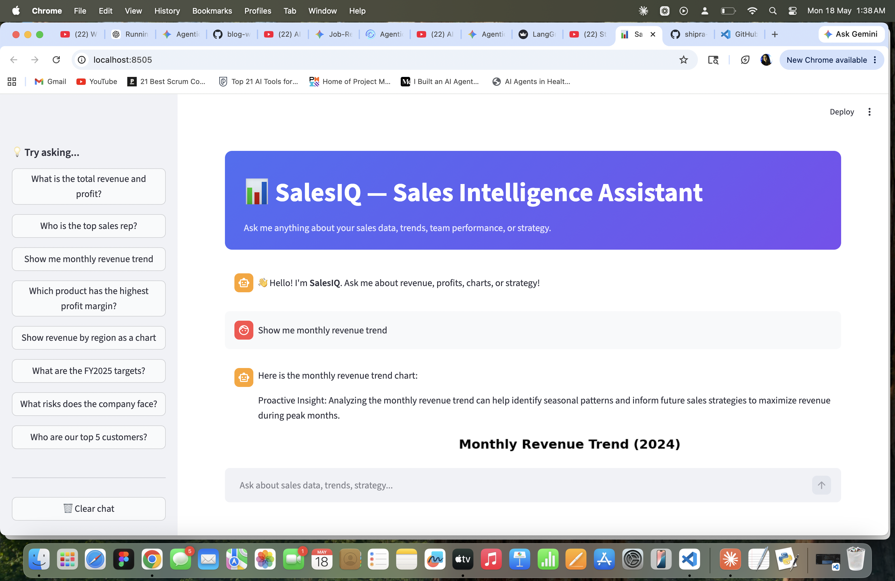
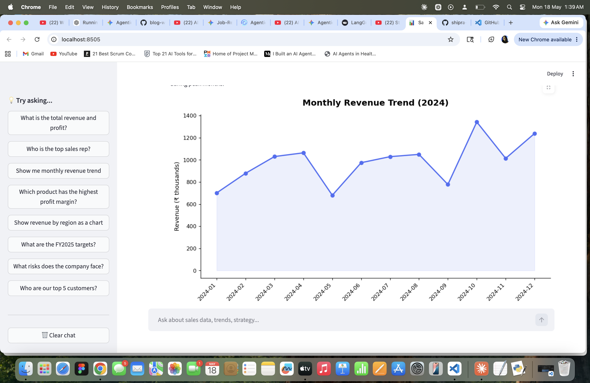
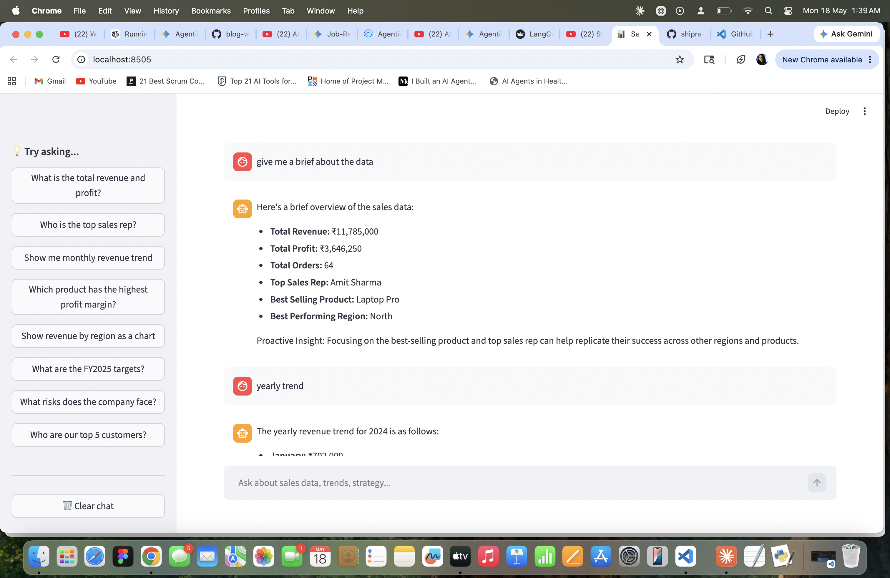

# 📊 SalesIQ — Agentic AI Sales Intelligence Assistant

> **Capstone Project** | Generative AI + Agentic AI + Data Analysis  
> Built with LangChain · OpenAI · FAISS · pandas · Streamlit

---



## 🎯 What This Project Does

SalesIQ is an AI-powered chatbot that acts as a smart sales analyst. You can ask it questions in plain English and it will:

- **Analyze sales CSV data** — revenue, profit, trends, top performers, comparisons
- **Generate charts** — just say "show me a chart of..."
- **Answer strategy questions** — from an embedded annual sales report using RAG

The agent *decides on its own* which tool to use. That's what makes it **agentic**.

---

## 🏗️ Project Structure

```
salesiq/
│
├── app.py                  ← Streamlit web UI (run this)
├── agent.py                ← LangChain agent (the brain)
│
├── tools/
│   ├── csv_tool.py         ← pandas data analysis tool
│   ├── chart_tool.py       ← matplotlib chart generation tool
│   └── rag_tool.py         ← FAISS + RAG document Q&A tool
│
├── data/
│   ├── sales_data.csv      ← 64 sales orders, FY2024
│   └── sales_report.txt    ← Annual strategy report (used for RAG)
│
├── vectorstore/            ← Auto-created when you first run
├── assets/                 ← Charts saved here
│
├── requirements.txt
├── .env.example
└── README.md
```

---

## 🚀 Setup & Run

### Step 1 — Clone and enter the project
```bash
cd salesiq
```

### Step 2 — Create a virtual environment
```bash
python -m venv venv

# Activate it:
# On Windows:
venv\Scripts\activate
# On Mac/Linux:
source venv/bin/activate
```

### Step 3 — Install dependencies
```bash
pip install -r requirements.txt
```

### Step 4 — Set up your API key
```bash
cp .env.example .env
```
Open `.env` and paste your OpenAI API key.

### Step 5 — Run the app
```bash
streamlit run app.py
```
The app opens in your browser at `http://localhost:8501`

---

## 💬 Example Questions You Can Ask

| Type | Example Question |
|------|-----------------|
| Revenue | "What is the total revenue for FY2024?" |
| Comparison | "Which region has the highest revenue?" |
| Performance | "Who is the top performing sales rep?" |
| Chart | "Show me monthly revenue trend as a chart" |
| Chart | "Plot revenue by region" |
| Profit | "Which product has the best profit margin?" |
| Strategy | "What are the FY2025 targets?" |
| Risk | "What risks does the company face?" |
| Customer | "Who are our top 5 customers?" |
| Team | "Tell me about Amit Sharma's performance" |

---

## 🧠 How the Agent Works (for interviews)

```
User asks a question
        ↓
LangChain Agent reads the question
        ↓
Agent decides: which tool should I call?
  ├── Numbers / data?     → csv_tool (pandas)
  ├── Wants a chart?      → chart_tool (matplotlib)
  └── Strategy / goals?  → rag_tool (FAISS + embeddings)
        ↓
Tool executes and returns result
        ↓
LLM formats a clear, human-friendly answer
        ↓
Streamlit displays the text + chart (if any)
```

---

## 🛠️ Tech Stack

| Technology | Role |
|------------|------|
| **LangChain** | Agent framework — orchestrates tools |
| **OpenAI GPT-4o-mini** | The reasoning engine / LLM |
| **FAISS** | Vector store for document embeddings (RAG) |
| **pandas** | Data analysis from CSV |
| **matplotlib** | Chart and visualization generation |
| **Streamlit** | Web UI |
| **python-dotenv** | Secure API key management |

---

## 📚 Concepts This Project Demonstrates

- ✅ **Agentic AI** — agent autonomously chooses tools
- ✅ **RAG** — Retrieval-Augmented Generation with FAISS
- ✅ **Tool use** — LangChain tools with `@tool` decorator
- ✅ **Conversation memory** — agent remembers last 6 messages
- ✅ **Data analysis with Python** — pandas, matplotlib
- ✅ **API integration** — OpenAI API via LangChain
- ✅ **Streamlit UI** — clean chat interface

---

## 👤 Author

**[Your Name]**  
Data Analyst | Generative & Agentic AI  
[LinkedIn] · [GitHub]

---

## 📝 License

MIT — feel free to use, modify, and share.
